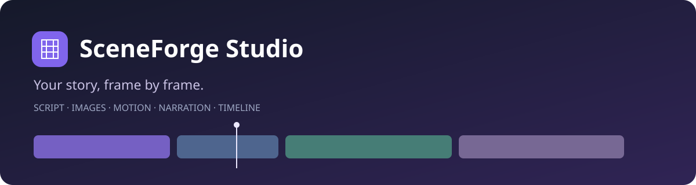

<div align="center">



# SceneForge Studio

**Turn scripts, images and narration into a finished video — one scene at a time.**


[Quick start](#quick-start) · [Editor](#the-editor) · [Providers](#image-and-voice-providers) · [Effects guide](docs/EFFECTS_GUIDE.md) · [Roadmap](#roadmap) · [Contributing](CONTRIBUTING.md)

</div>

SceneForge is a local web editor for documentary, educational and narrated-image videos. Arrange parts on a timeline, add camera movement, captions and narration, then export one MP4. Arabic text and local multilingual narration are part of the workflow.

> **Current release: Timeline Studio.** The editor runs in your browser with a local Python backend. An EXE/MSI installer, bundled runtimes and automatic model installation are planned, not included. Cloud generation is optional and uses your own provider account.

## The editor

| Workspace | What you can do |
|---|---|
| Project library | Create, find, rename and delete projects |
| Media | Upload images/clips, generate images, reuse generation history, select fit |
| Motion | Zoom, pan, close-up, diagonal moves and combined push/pan or pull/pan |
| Effects | Color looks, film grain, full-frame glitch, strength adjustment and rendered preview |
| Text | Arabic-capable fonts, captions, timed text layers and typewriter sound |
| Audio | Connect local Chatterbox/Kokoro or upload recorded narration |
| Timeline | Automatically list parts, drag to reorder, zoom time scale and set incoming transitions |
| Export | Render scenes and combine them into one MP4 with audio and transitions |

The timeline is a **scene assembly timeline**, not a multitrack NLE. Its narration strip shows whether a take is selected; it is not a waveform. Use the rendered export to preview the complete movie. Empty scenes stay in the awaiting-media tray and can be skipped at export with confirmation.

## Quick start

<details open>
<summary><strong>Windows · recommended setup</strong></summary>

Install Python 3.11+, Node.js 20+ and FFmpeg/ffprobe, available on PATH. Git is needed only for cloning. Then:

```powershell
git clone https://github.com/EzioDEVio/SceneForge.git
cd SceneForge
scripts\setup.bat
scripts\start.bat
```

Open **http://127.0.0.1:8000**. Keep the server window open while editing. Stop it with Ctrl+C.

The setup creates `backend/.venv`, installs dependencies, and builds the frontend. No provider key is needed to upload media and export video.

</details>

<details>
<summary><strong>macOS / Linux · manual development setup</strong></summary>

Install Python, Node and FFmpeg first:

```bash
python3 -m venv backend/.venv
backend/.venv/bin/python -m pip install -r backend/requirements.txt
npm --prefix frontend ci
npm --prefix frontend run build
cd backend
.venv/bin/python -m uvicorn app.main:app --host 127.0.0.1 --port 8000
```

The Windows launchers are the primary supported startup path. Local voice engine performance depends on your hardware.

</details>

### Update an existing ZIP installation

Stop the server and back up `backend/data`. Copy the repository's app files into your existing app root; retain its `backend/data` and `.venv`. Run setup, restart and refresh with Ctrl+F5. Do not run two copies against port 8000. `/api/health` should report `timeline-studio-1`. Old APPLY_* update scripts are not required.

## Make your first video

1. Create a project and select its aspect ratio.
2. Add an image or clip to each part. Add narration or choose no narration.
3. Choose motion, an effect and optional captions/typewriter text.
4. Arrange parts on the timeline. Select an incoming part to choose a transition.
5. Render a scene to inspect exact motion/effects/audio.
6. Choose **Export video**, then preview or download the full MP4.

Transitions include Cut, Dissolve, Fade through black/white, Slide left/right, Wipe left/right and Circle reveal. A transition moves with its incoming part when reordered; the first exported part has no incoming transition. Overlap is capped at half of each neighbouring scene. Narration crossfades too, so use short transitions or silent handles.

Timeline timings are estimates derived from the selected take or fixed duration. Frame rounding and rendering determine the final output length. Motion currently requires Cover fit; Fit/Blur fit preserve the full source image.

## Image and voice providers

| Service | Role | Setup / cost model |
|---|---|---|
| OpenAI | Image generation | Your API key; paid usage |
| Google Gemini | Image generation | Your API key and supported image model |
| Cloudflare Workers AI | FLUX.1 Schnell images | API token + Account ID; limited daily allowance |
| Hugging Face | Routed image generation | HF token; small monthly credits, model availability varies |
| AUTOMATIC1111 | Local image generation | Local image model and engine running with `--api` |
| Chatterbox | Local multilingual narration | Separate service; current launcher uses Docker Desktop |
| Kokoro | Local narration | Separate service; current launcher uses Docker Desktop; no Arabic |
| Recorded audio | Narration | Upload WAV, MP3 or other supported audio |

**Anthropic:** Claude analyzes images and writes prompts, but does not offer photo/illustration generation. It is not presented as an image engine. See [Anthropic's explanation](https://support.claude.com/en/articles/9002504-can-claude-produce-images).

See [provider setup](START_HERE_EDITOR_PLUS.md#image-provider-setup). Free allowances are not unlimited; check [Cloudflare billing](https://developers.cloudflare.com/workers-ai/platform/pricing/) and [HF credits](https://huggingface.co/docs/inference-providers/pricing/). Local models and their licenses are separate downloads. Azure is not integrated.

## Architecture

| Directory | Responsibility |
|---|---|
| `frontend/src` | React editor, timeline and API client |
| `backend/app/api` | FastAPI endpoints and validation |
| `backend/app/render` | FFmpeg filters, captions, sound, transitions and cache hashes |
| `backend/app/workers` | Render jobs, progress and cancellation |
| `backend/app/providers` | Image generation and local narration adapters |
| `services` | Optional voice service containers |
| `assets` | Bundled fonts and synthetic typewriter sound |
| `tests` | API/render integration tests |
| `scripts` | Windows setup and launchers |

Data lives in `backend/data` by default. Set `SCENEFORGE_DATA_DIR` to relocate it. Deleting a project removes its database records but retains media files on disk. Back up the whole data folder, not just the SQLite database.

Provider keys currently use reversible local obfuscation, **not an OS credential vault**. Keep the app bound to localhost and protect your data folder. See [security notes](SECURITY.md).

## Development and validation

```bash
npm --prefix frontend ci
npm --prefix frontend run build
npm --prefix frontend test
python -m pip install -r backend/requirements.txt numpy httpx
python tests/integration/test_combined.py
python tests/integration/test_editor_plus.py
python tests/integration/test_timeline.py
```

Run integration scripts sequentially; some reserve a fixed local port. FFmpeg must be installed. React checks use jsdom, not browser screenshots. Hosted APIs are mocked; no CI job spends provider credits or downloads large voice/image models. See [validation scope](docs/VALIDATION.md).

## Roadmap

- [x] Local scene editor, image generation, captions and full-video export
- [x] Local voice service connections and audio upload
- [x] Project deletion and search
- [x] Scene timeline, transition palette and expanded motion
- [ ] Select additional aged-film effects from the [effects guide](docs/EFFECTS_GUIDE.md)
- [ ] Continuous timeline playback, scrubbing, trimming and audio waveforms
- [ ] Desktop shell, EXE/MSI installation and managed model downloads
- [ ] OS-backed credential storage and production release hardening

## Contributing

Report bugs with steps, app build, OS and redacted logs. For render issues, include aspect ratio, duration, selected effects and whether narration is present. See [CONTRIBUTING.md](CONTRIBUTING.md).

## Licensing and acknowledgements

A project-wide redistribution license has not yet been selected. Do not infer one from the repository being accessible. Bundled Noto fonts carry the SIL Open Font License; see `assets/fonts/OFL-LICENSE.txt`. The synthetic keystroke source is documented in `assets/sfx/SOURCE.md`. FFmpeg, dependencies and optional models retain their respective licenses.

