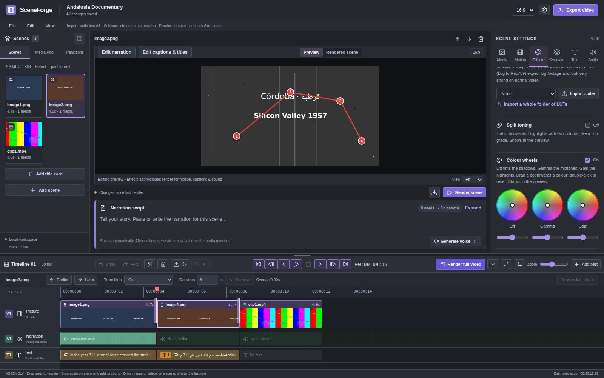
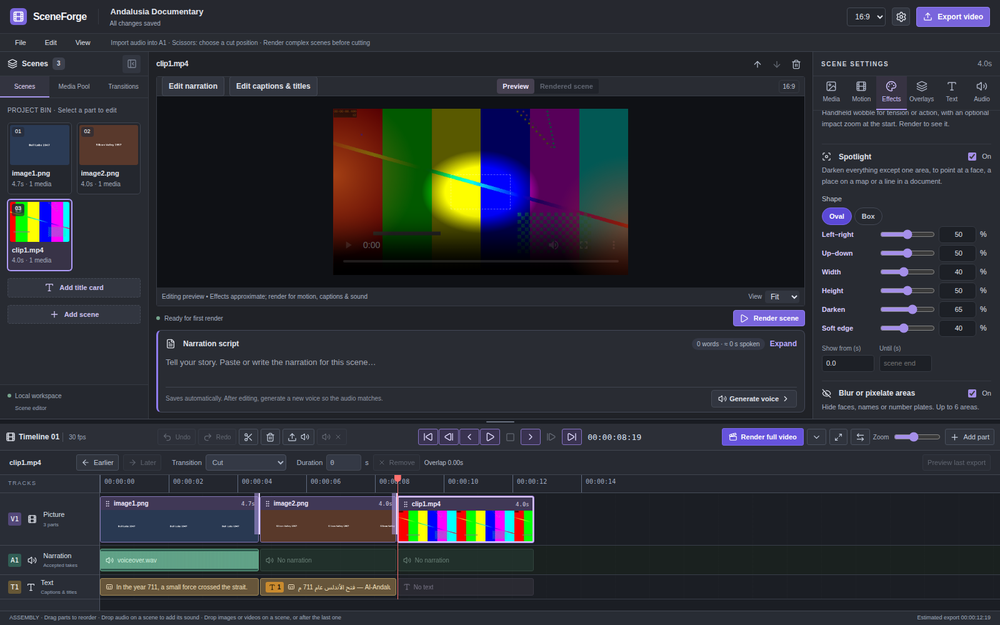
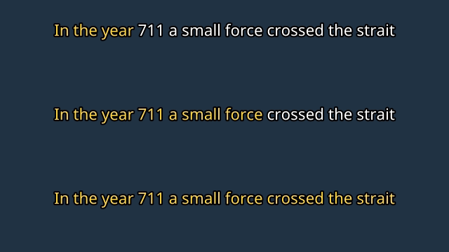

<p align="center"></p>

# SceneForge Studio

**Free, open-source desktop editor for narrated documentary videos.** Turn a script, photos, clips and a voice into a finished film, one scene at a time, with film-style looks, captions that follow the narration, music, maps and more. Arabic and English are first-class.

[Download](#download) · [What it can do](#what-it-can-do) · [AI providers](#ai-providers) · [Build from source](#build-from-source) · [Contributing](CONTRIBUTING.md) · [License](#license)



## Download

Get the installer for your system from the **[latest release](https://github.com/EzioDEVio/SceneForge/releases/latest)**.

| System | File | First launch |
|---|---|---|
| **Windows 10/11** (64-bit) | `SceneForge-Studio-<version>-Windows-x64-Setup.exe` | Windows may show *"Windows protected your PC"*. Click **More info → Run anyway**. This appears because SceneForge is a free project without a paid code-signing certificate. |
| **Linux** (64-bit) | `.AppImage` (any distribution) or `.deb` (Ubuntu/Debian) | AppImage: make it executable (`chmod +x`) and run it. Deb: `sudo apt install ./SceneForge-Studio-*.deb` |
| **macOS** (Apple Silicon) | `.dmg` | Drag SceneForge to Applications. The first time, **right-click the app → Open → Open** (macOS blocks unsigned apps on a normal double-click). *macOS builds are experimental.* |

**Updates:** on Windows and Linux (AppImage) SceneForge downloads new versions in the background and asks to restart. On macOS it tells you when a new version is out and opens the download page. Help → *Receive beta updates* opts in to test versions.

**Your projects are safe across updates:** they live in your user folder, separate from the app, and the project database is backed up automatically before a new version opens it (Help → *Open project backups*; the last 5 are kept).

## What it can do



**Scenes and timeline** — scene-by-scene timeline with picture, narration and text lanes; drag-and-drop images, videos, audio and whole folders; 25 transitions including film burn, wind and clock wipe; keyboard shortcuts; undo/redo; split scenes; resizable settings panel.

**Pictures and motion** — Ken Burns zoom and pan with smooth easing; **3D photo (parallax)**, which gives still photos depth; **picture-in-picture overlays** you drag and resize on the preview, with borders, rounded corners, shadows, animations, glide paths and green screen; **split screen** (side by side, top & bottom, three panels, 2×2); **animated map routes** you draw by clicking on the preview; video clip speed, slow-motion ramps and freeze frames; **restore old photo** (dust, grain, contrast and sharpness for archive scans).

**Looks** — 18 looks including VHS and full-frame glitch; **Old film** (scratches, dust, hair, flicker, gate weave, 16/18 fps projector motion, black & white or sepia, projector sound); colour sliders, **colour wheels**, split toning and **.cube LUT import** (3D, 1D and DaVinci Resolve shaper LUTs); camera shake with impact zoom; spotlight; blur or pixelate areas to hide faces and names; light leaks.

**Text** — captions with correct Arabic right-to-left layout; **word-by-word captions** that follow the voice (exact timing with ElevenLabs, measured from the audio for other voices) in fill, pop or glow styles; animated title layers; typewriter reveal with sound.



**Sound** — narration from AI voices or your own recordings; trim, volume, fades and waveform editing; voice effects (clean up, 1940s radio, telephone); background music that loops and **ducks under narration** automatically; **sync scene cuts to the beat**; loudness levelling for YouTube (-14 LUFS); film countdown leader.

**Export** — one MP4 with everything rendered by FFmpeg, bundled with the app.

## AI providers

AI is optional. You can build a complete video from your own photos, clips and recordings without any account.

| Purpose | Cloud (your own account/key) | Local (free, on your computer) |
|---|---|---|
| Images | OpenAI, Google Gemini, Cloudflare Workers AI, Hugging Face | Stable Diffusion via AUTOMATIC1111 (point SceneForge at its folder: *AI Engines* menu) |
| Voice | ElevenLabs (with exact word timing), Together AI | Chatterbox (multilingual incl. Arabic), Kokoro |

Keys are stored in your operating system's credential store (Windows Credential Manager, macOS Keychain, Linux Secret Service), never in the project files.

**Coming next:** an AI providers workspace with a built-in model manager and free offline engines (Piper voices, Whisper captions, a compact Stable Diffusion engine), so no separate installs or Docker are needed. See the [roadmap](#roadmap).

## Build from source

Requirements: Python 3.11+, Node.js 20+, and FFmpeg (only for running from source; the installers bundle it).

**Windows**
```bat
git clone https://github.com/EzioDEVio/SceneForge.git
cd SceneForge
scripts\setup.bat
scripts\start.bat
```
Then open http://127.0.0.1:8000.

**macOS / Linux**
```bash
git clone https://github.com/EzioDEVio/SceneForge.git && cd SceneForge
python3 -m venv .venv && .venv/bin/pip install -r backend/requirements.txt
npm --prefix frontend ci && npm --prefix frontend run build
cd backend && ../.venv/bin/python -m uvicorn app.main:app --host 127.0.0.1 --port 8000
```

**Build the desktop installers yourself**
```bash
pip install -r desktop/requirements-build.txt
npm --prefix frontend ci && npm --prefix frontend run build
npm --prefix desktop ci
python desktop/scripts/fetch_ffmpeg.py        # downloads and verifies FFmpeg for your OS
python desktop/scripts/build_backend.py       # bundles the Python backend
npm --prefix desktop run dist:win             # or dist:mac / dist:linux
```

## Releasing (maintainers)

1. Set the version in `desktop/package.json` (e.g. `0.3.1`, or `0.3.1-beta.1` for a beta).
2. Commit, then tag and push: `git tag v0.3.1 && git push origin v0.3.1`.
3. The **Release** workflow tests everything, builds Windows, Linux and macOS installers on GitHub's machines, and attaches them to a **draft** release.
4. Review the draft and click **Publish release**. Only then do users' apps offer the update.

## Architecture

| Folder | What it is |
|---|---|
| `frontend/` | React + TypeScript editor |
| `backend/app/` | FastAPI server, SQLite database, FFmpeg rendering (`render/`), providers |
| `desktop/` | Electron shell, updater, packaging and build scripts |
| `assets/` | Bundled fonts and sounds |
| `tests/` | Integration tests that render real video and measure the result |

## Roadmap

- [x] Scene editor, timeline, transitions, captions, export
- [x] Film looks, LUTs, colour grading, overlays, map routes, split screen, 3D photos
- [x] Word-by-word captions, music ducking, beat sync, loudness
- [x] Desktop installers for Windows, Linux and macOS with automatic updates
- [ ] AI providers workspace and model manager with free offline engines (Piper, Whisper, Stable Diffusion)
- [ ] Colorize black & white photos; automatic subject detection for 3D photos (local AI models)
- [ ] Signed installers (free open-source signing programmes are being considered)

## License

SceneForge Studio is free software: you can redistribute it and/or modify it under the terms of the **GNU General Public License v3.0 or later** as published by the Free Software Foundation. See [LICENSE](LICENSE).

It is distributed in the hope that it will be useful, but WITHOUT ANY WARRANTY. Bundled components (FFmpeg, Electron, Python libraries, Noto fonts) keep their own licenses; see [desktop/THIRD_PARTY.md](desktop/THIRD_PARTY.md). AI models and cloud services are not part of SceneForge and have their own terms.

Copyright © 2026 EzioDEVio and SceneForge contributors.
