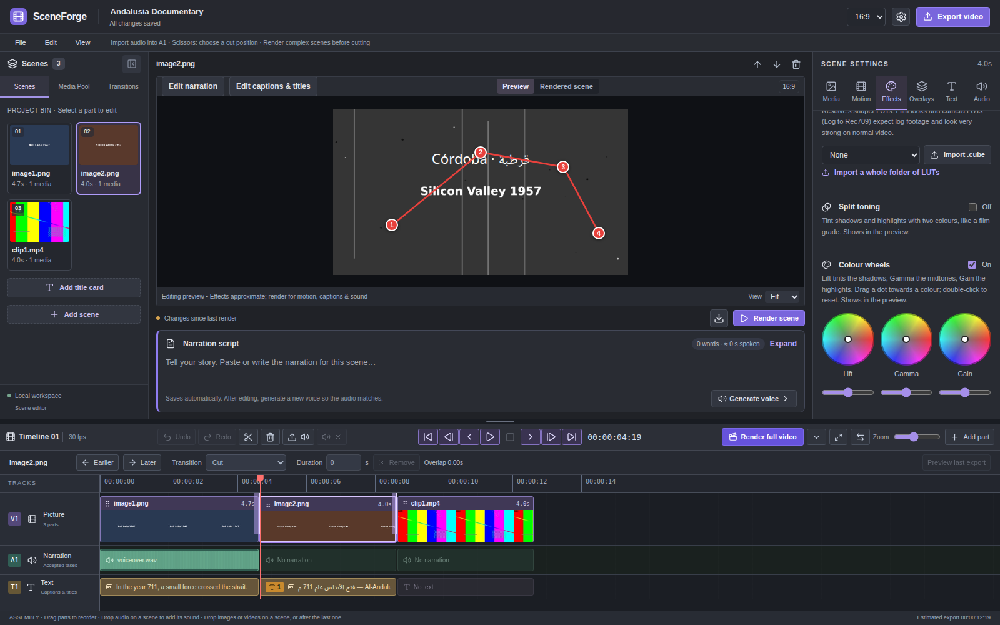
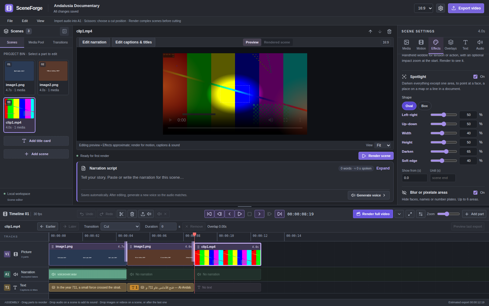
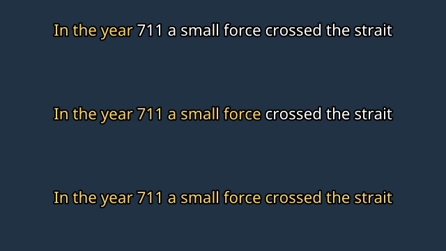

<p align="center"></p>

# SceneForge Studio

**Free, open-source desktop editor for narrated documentary videos.** Turn a script, photos, clips and a voice into a finished film, one scene at a time, with film-style looks, captions that follow the narration, music, maps and more. Arabic and English are first-class.

[Download](#download) · [What it can do](#what-it-can-do) · [Project milestones](#project-milestones) · [AI providers](#ai-providers) · [Build from source](#build-from-source) · [Combined history and handoff](PROJECT_HISTORY_AND_HANDOFF.md) · [Contributing](CONTRIBUTING.md) · [License](#license)



## Download

Get the installer for your system from the **[latest release](https://github.com/EzioDEVio/SceneForge/releases/latest)**.

| System | File | First launch |
|---|---|---|
| **Windows 10/11** (64-bit) | `SceneForge-Studio-<version>-Windows-x64-Setup.exe` | Windows may show *"Windows protected your PC"*. Click **More info → Run anyway**. This appears because SceneForge is a free project without a paid code-signing certificate. |
| **Linux** (64-bit) | `.AppImage` (any distribution) or `.deb` (Ubuntu/Debian) | AppImage: make it executable (`chmod +x`) and run it. Deb: `sudo apt install ./SceneForge-Studio-*.deb` |
| **macOS** (Apple Silicon) | `.dmg` | Drag SceneForge to Applications. The first time, **right-click the app → Open → Open** (macOS blocks unsigned apps on a normal double-click). *macOS builds are experimental.* |

**Updates:** on Windows and Linux (AppImage) SceneForge downloads new versions in the background and asks to restart. On macOS it tells you when a new version is out and opens the download page. Help → *Receive beta updates* opts in to test versions.

**Your projects are safe across updates:** they live in your user folder, separate from the app, and the project database is backed up automatically before a new version opens it (Help → *Open project backups*; the last 5 are kept).

### Current candidate status

The latest **published** release remains **0.5.3**. The unreleased **0.7.0 RC5** candidate lives on the local branch `claude/0.7.0-rc5-timeline`, which builds on the RC4 commit `3d6107a` (the same source tree as `chatgpt/0.7.0-video-generation` at `c9a8ee7`). The RC4 package workflow passed on Windows, Linux and macOS, including the Windows installed-app startup, render and uninstall checks; its installer is a temporary [GitHub Actions artifact](https://github.com/EzioDEVio/SceneForge/actions/runs/36763871298), not a public release. RC4's failing build-and-render gate (`tests/integration/test_editor_plus.py`, active-render deletion) is fixed in RC5 and passes locally, and GitHub has not rerun it because RC5 has not been pushed. Keep the candidate unmerged and unpublished until CI reruns green and the Windows installer is tested.

The full implementation inventory, troubleshooting decisions, test record, pending work and historical release notes are in the [combined project handoff and release history](PROJECT_HISTORY_AND_HANDOFF.md).

## What it can do



**Scenes and timeline** — scene-by-scene timeline with picture, narration, source-video-audio and text lanes; drag-and-drop images, videos, audio and whole folders; 28 curated transitions with live previews (older saved transition types still render); keyboard shortcuts; undo/redo; split and ripple-delete scenes; multi-select and batch apply; ruler snapping; named point and range markers with colours, saved with the project; per-lane locks saved with the project; quick mute for embedded clip sound; linked source video/audio edge trimming for eligible single-video scenes. **Timeline audio tracks A3–A8** hold independent audio clips, and each track has mute, solo and lock. There are edit tools for those clips: Select (V), Track select forward (A), Ripple (B), Roll (N), Slip (Y), Slide (U) and Blade (C). Razor All is Shift+C. Ctrl+wheel zooms around the pointer. Pictures remain scene-based on V1; this is not yet a full multitrack video editor. See [docs/TIMELINE_ARCHITECTURE.md](docs/TIMELINE_ARCHITECTURE.md).

**Pictures and motion** — Ken Burns zoom and pan with smooth easing; **3D photo (parallax)**, which gives still photos depth; **picture-in-picture overlays** you drag and resize on the preview, with borders, rounded corners, shadows, animations, glide paths and green screen; **split screen** (side by side, top & bottom, three panels, 2×2); **animated map routes** you draw by clicking on the preview; video clip speed, slow-motion ramps and freeze frames; **restore old photo** (dust, grain, contrast and sharpness for archive scans).

**Looks and filters** — 35 scene look/effect choices, including VHS and full-frame glitch; **8 additional color filters** (Golden hour, Arctic, Portra film, Matte fade, Color pop, Teal shadows, Rose glow and Blue monochrome); and **2 new creative effects** (Chromatic split and Motion trail), each rendered through FFmpeg. Also includes **Old film** (scratches, dust, hair, flicker, gate weave, 16/18 fps projector motion, black & white or sepia, projector sound); colour sliders, **colour wheels**, split toning and **.cube LUT import** (3D, 1D and DaVinci Resolve shaper LUTs); camera shake with impact zoom; spotlight; blur or pixelate areas to hide faces and names; and light leaks.

**Text** — captions with correct Arabic right-to-left layout; automatic captions from narration or video sound (free local Whisper, with optional cloud services); **31 caption styles** and word-by-word timing; animated title layers; typewriter reveal with sound.



**Sound** — narration from AI voices or your own recordings; trim, volume, fades and waveform editing; voice effects (clean up, 1940s radio, telephone); background music that loops and **ducks under narration** automatically; **sync scene cuts to the beat**; loudness levelling for YouTube (-14 LUFS); film countdown leader.

**Export** — platform presets for YouTube, TikTok/Reels/Shorts and Instagram; advanced resolution up to 4K, frame rate, quality and format controls; MP4, H.265, WebM, ProRes, GIF, MP3 and WAV; SRT/VTT caption files. Video sound is preserved and can be adjusted per clip.

**Share and overlays** — after export, a local-first Share dialog offers download, file-location access in the desktop app, and upload steps for YouTube, TikTok, Instagram and Facebook. Direct account uploads are not included. Overlays also include a searchable, categorized library of **66 emoji and graphic stickers**; selected items use the standard image-overlay editor and render pipeline.

**Preferences (0.7.0 candidate)** — open Preferences from **File**. Choose the Graphite Night, Daylight, Midnight Blue or Warm Studio theme, an accent color, panel spacing and reduced interface motion. Theme selection is also available in the editor’s upper-right corner. Project aspect ratio and frame rate are set in **Create Project**; the editor keeps the current project’s aspect control. The desktop close dialog offers Save, Don’t save, Save and exit, or Cancel.

**Text-to-video (0.7.0 WIP)** — a dark, high-contrast Generate Video workspace offers step-by-step local ComfyUI/model guidance, VRAM-aware model suggestions, Google/Runway key instructions, and paid estimates that scale to 1–3 candidate videos. Compare finished takes and add the selected one to a new or existing scene. Image Studio also supports 1–3 selectable options. Existing clip audio, captions, styles, effects and overlays remain available. Cloud video requests require an explicit total-cost confirmation in the UI and backend.

The features above include the **0.6.0 work in progress** and the **0.7.0 release candidate** from source. The candidate is being tested on its branch and is not a published release; use the latest published installer for the stable build.

## Project milestones

This table summarizes the documented product history. The detailed, cumulative entries begin with the archived **0.2.0 RC3** notes; earlier prototype history is not reconstructed here. Versions marked WIP or RC were development snapshots, not public releases.

| Version | Milestone |
|---|---|
| **0.2.0 RC3–RC5** | Built out the scene editor: overlays/PiP, music and clip-audio editing, LUT import, film looks, transitions, photo restoration, split screen, map routes, 3D photos, motion controls and Arabic-aware caption rendering. These were prerelease milestones. |
| **0.3.0** | First public open-source release, with Windows/Linux/macOS installers, updater and project backups. |
| **0.3.1–0.3.4** | Guided AI Engines and Help, diagnostics, safer local-model startup, real transition/look previews, map-route improvements, paste-media support, branded installer and Windows stability fixes. |
| **0.4.0–0.4.1** | Animated titles and captions, text styles, animated annotations and Arabic map-label rendering fixes. |
| **0.5.0** | Captions Pro: expanded caption styles, fonts, Arabic styles, phrase/word timing, formatting, positioning and animation. |
| **0.5.1–0.5.2** | Direct annotation editing, accurate arrow previews, scene copy/duplicate/paste and preview zoom/pan. |
| **0.5.3** | Preserved video sound and source duration, per-clip sound controls, scene countdown intros, 9:16 fit/blur behavior, caption safe positioning and platform safe-zone overlay. This is the latest published release. |
| **0.6.0 WIP** | Additive editor expansion: local Whisper captions, transition/caption packs, multi-select, progress cards, export formats/presets, T1 timed editable caption clips, feature-help popovers, sharing, emoji/stickers, filters, and timeline/history/audio restoration. It remains unreleased. |
| **0.7.0 RC9** | RC8 plus:<br>• 400 stickers and emoji<br>• 71 caption styles<br>• Settings for 36 effects<br>• Clock and iris text reveals<br>• Moving-video subject cutout<br>• Clip groups and clip-attached markers<br><br>Unreleased. |
| **0.7.0 RC8** | RC7 plus:<br>• Better cutout (edge refinement, people model, preview; the small model is bundled)<br>• AI voice isolation<br>• Beat markers<br>• Volume envelopes on timeline audio<br>• Effect stack ordering and bypass<br>• Look preset packs (drag-and-drop, with a starter pack)<br><br>Unreleased. |
| **0.7.0 RC7** | RC6 plus:<br>• Local Whisper fixed (audio decoded by FFmpeg, without PyAV)<br>• No more black first render<br>• AI subject cutout (text behind subject, background removal)<br>• Textured titles (9 patterns, a Media Pool image, or a prompt-generated texture)<br><br>Unreleased. |
| **0.7.0 RC6** | RC5 plus the Windows test fixes and more:<br>• Delete removes only the cut audio piece<br>• Right-click menus for clips, scenes, narration and clip sound<br>• Narration or clip sound can be detached to A3 for cutting<br>• Scene renders play the timeline audio and music under them<br>• Local Whisper diagnostics and self-repair<br>• In-app Chatterbox and Kokoro start<br>• FFmpeg effects pack: camera shake, lens flare (Screen/Add), wiggle, focus blur, tilt-shift, mosaic, halation and film grades, text reveals, float/pendulum stickers, speed-ramp curves, beat-aware music fit, dialogue cleanup<br><br>Unreleased. |
| **0.7.0 RC5** | Everything in RC4, plus the active-render deletion CI fix (a job ID is reserved as live before its row is committed) and timeline v1: audio tracks A3–A8 with mute/solo/lock, V/A/B/N/Y/U/C edit tools with Razor All, project-saved colour/range markers and locks, a versioned timeline format that migrates older projects, and viewport virtualization. Unreleased. |
| **0.7.0 RC4** | Text-to-video and image candidate generation, local ComfyUI setup/hardware guidance, paid-provider cost estimates and confirmation, preferences/themes, safer close flow, improved timeline/audio/captions/transition curation and additional filters. Unreleased; its failed CI gate is fixed in RC5. |

See [`desktop/RELEASE_NOTES.md`](desktop/RELEASE_NOTES.md) for version-by-version detail, including fixes and verification, and [`handoff.md`](handoff.md) for the working-session history.

## AI providers

AI is optional. You can build a complete video from your own photos, clips and recordings without any account.

| Purpose | Cloud (your own account/key) | Local (free, on your computer) |
|---|---|---|
| Images | OpenAI, Google Gemini, Cloudflare Workers AI, Hugging Face | Stable Diffusion via AUTOMATIC1111 (point SceneForge at its folder: *AI Engines* menu) |
| Voice | ElevenLabs (with exact word timing), Together AI | Chatterbox and Kokoro (separate services); espeak is an optional basic fallback with its own install |
| Captions | OpenAI Whisper or ElevenLabs Scribe | Faster-Whisper (model download required once) |
| Text-to-video | Google Veo 3.1 and Runway Gen-4.5 / WAN 3.0 APIs | ComfyUI workflows for LTX-2.5, Wan 2.1, Wan 2.2 and compatible custom workflows |

### Text-to-video model choices and prices

The 0.7.0 WIP catalog below shows the provider's published USD rate per generated second and estimates the selected clip's cost before a request starts. Users can generate 1–3 video or image options to compare. Cloud video estimates and consent cover the full candidate count; hosted image providers show that each result may incur a separate charge. Prices were checked on **2026-09-28** and can change; provider billing, taxes, account credits, retries and regional terms can affect the final charge. Local generation has no API fee, but uses the user's hardware and electricity. Review each model's license before publishing or using output commercially.

| Provider and model | Published price | Current output options in SceneForge |
|---|---:|---|
| Google Veo 3.1 Lite | $0.05/sec at 720p; $0.08/sec at 1080p | 4, 6 or 8 sec; 16:9 or 9:16; 1080p only at 8 sec |
| Google Veo 3.1 Fast | $0.10/sec at 720p; $0.12/sec at 1080p; $0.30/sec at 4K | 4, 6 or 8 sec; 16:9 or 9:16; 1080p/4K only at 8 sec |
| Google Veo 3.1 Standard | $0.40/sec at 720p or 1080p; $0.60/sec at 4K | 4, 6 or 8 sec; 16:9 or 9:16; 1080p/4K only at 8 sec |
| Runway Gen-4.5 | $0.12/sec (12 credits/sec at $0.01 per credit) | 2–10 sec at 720p; 16:9 or 9:16 |
| Runway WAN 3.0 | $0.05/sec at 480p; $0.10/sec at 720p; $0.20/sec at 1080p | 2–30 sec; 16:9 or 9:16; native audio |

Official price references: [Google Veo pricing](https://ai.google.dev/gemini-api/docs/pricing#veo), [Google Veo API options](https://ai.google.dev/gemini-api/docs/veo), [Runway API pricing](https://docs.dev.runwayml.com/guides/pricing/), [Runway API changelog](https://docs.dev.runwayml.com/api-details/api_changelog/).

Key setup guides: [Google AI Studio key instructions](https://ai.google.dev/gemini-api/docs/api-key), [Google AI Studio API keys](https://aistudio.google.com/app/apikey), [Runway API account/key/credit setup](https://docs.dev.runwayml.com/guides/setup/), [Runway Dev console](https://dev.runwayml.com/). SceneForge stores provider keys through the operating system credential store.

**Local model catalog:** LTX-2.5 Fast, Wan 2.1 T2V 1.3B, Wan 2.2 TI2V 5B, Wan 2.2 T2V A14B, plus a Custom ComfyUI workflow option. Models differ in quality, speed, audio, resolution and GPU needs. For an 8 GB card, ComfyUI says its Wan 2.2 5B workflow should fit with native offloading; begin at 480p. Wan 2.1 T2V 1.3B at 480p is a lighter fallback. A desktop GeForce RTX 4090 lists 24 GB; the 4090 Laptop is listed at 16 GB, so if SceneForge detects 8 GB, check the actual GPU and available memory before downloading. See the [Wan 2.2 setup](https://docs.comfy.org/tutorials/video/wan/wan2_2), [NVIDIA memory matrix](https://docs.nvidia.com/nim/visual-genai/latest/support-matrix.html) and [LTX ComfyUI setup](https://docs.ltx.io/open-source-model/integration-tools/comfy-ui).

**Local setup:** The generator now has a step-by-step guide, direct links, ComfyUI connection check and optional GPU/VRAM-based model suggestion. ComfyUI, model weights, required custom nodes and API-format workflow files are still installed separately; they are not bundled or downloaded automatically by SceneForge. Start ComfyUI, connect its loopback address under **Settings → Providers**, download the matching model and workflow, export with **Save (API Format)**, then import the JSON into Generate Video. Custom ComfyUI nodes execute inside ComfyUI with the user's permissions, so import workflows and nodes from sources you trust. Local custom dimensions must be multiples of 16. Cloud providers expose only their supported sizes, ratios and durations. Google and Runway setup panels link to key creation pages and explain adding a key under **Settings → Providers**.

**Multiple options:** The generator creates candidates sequentially. Each finished video is previewable and separately saved in the Media Pool; select one before adding it to the timeline. SceneForge retains completed options if a later take fails or is cancelled. Image Studio similarly shows a 1–3 option chooser before attaching an image to the scene.

**Remote GPU direction:** Vast.ai has not been connected to the app. The [remote GPU feasibility note](docs/VAST_GPU_RELAY_PROPOSAL.md) proposes a text-to-video benchmark and a separate, opt-in relay if the all-in compute/storage/transfer costs are worthwhile.

**What installs:** Source setup needs Python, Node.js and FFmpeg. The Windows desktop installer bundles the app, private backend runtime and FFmpeg so end users do not need those tools installed separately. Optional Chatterbox/Kokoro narration servers and Stable Diffusion image generation are separate installs today; their large models are not bundled. The Whisper model downloads automatically the first time captions run. Rendering and exports use local FFmpeg; cloud features only run when you choose a provider and supply its key.

Keys are stored in your operating system's credential store (Windows Credential Manager, macOS Keychain, Linux Secret Service), never in the project files.

**Automatic captions:** Local Faster-Whisper transcription is included in the backend dependencies. Its multilingual model downloads once when first used (internet required for that first download), then runs on the user's CPU without an API key or network connection. ElevenLabs and OpenAI remain optional cloud services.

## Build from source

Requirements: Python 3.11+, Node.js 20+, and FFmpeg (only for running from source; the desktop installer bundles its backend runtime and FFmpeg). Local captioning downloads a Whisper model on first use. The optional Chatterbox/Kokoro speech servers and Stable Diffusion image-generation server remain separate installs; the desktop installer does not bundle these large models or services.

**Windows**
```bat
git clone https://github.com/EzioDEVio/SceneForge.git
cd SceneForge
scripts\setup.bat
scripts\start.bat
```
Then open http://127.0.0.1:8000.

**macOS / Linux**
```bash
git clone https://github.com/EzioDEVio/SceneForge.git && cd SceneForge
python3 -m venv .venv && .venv/bin/pip install -r backend/requirements.txt
npm --prefix frontend ci && npm --prefix frontend run build
cd backend && ../.venv/bin/python -m uvicorn app.main:app --host 127.0.0.1 --port 8000
```

**Build the desktop installers yourself**
```bash
pip install -r desktop/requirements-build.txt
npm --prefix frontend ci && npm --prefix frontend run build
npm --prefix desktop ci
python desktop/scripts/fetch_ffmpeg.py        # downloads and verifies FFmpeg for your OS
python desktop/scripts/build_backend.py       # bundles the Python backend
npm --prefix desktop run dist:win             # or dist:mac / dist:linux
```

## Releasing (maintainers)

1. Set the version in `desktop/package.json` (e.g. `0.3.1`, or `0.3.1-beta.1` for a beta).
2. Commit, then tag and push: `git tag v0.3.1 && git push origin v0.3.1`.
3. The **Release** workflow tests everything, builds Windows, Linux and macOS installers on GitHub's machines, and attaches them to a **draft** release.
4. Review the draft and click **Publish release**. Only then do users' apps offer the update.

## Architecture

| Folder | What it is |
|---|---|
| `frontend/` | React + TypeScript editor |
| `backend/app/` | FastAPI server, SQLite database, FFmpeg rendering (`render/`), providers |
| `desktop/` | Electron shell, updater, packaging and build scripts |
| `assets/` | Bundled fonts and sounds |
| `tests/` | Integration tests that render real video and measure the result |

## Roadmap

- [x] Scene editor, timeline, transitions, captions, export
- [x] Film looks, LUTs, colour grading, overlays, map routes, split screen, 3D photos
- [x] Word-by-word captions, music ducking, beat sync, loudness
- [x] Desktop installers for Windows, Linux and macOS with automatic updates
- [ ] AI providers workspace and model manager for optional local speech and image models
- [ ] Colorize black & white photos; automatic subject detection for 3D photos (local AI models)
- [ ] Signed installers (free open-source signing programmes are being considered)

## License

SceneForge Studio is free software: you can redistribute it and/or modify it under the terms of the **GNU General Public License v3.0 or later** as published by the Free Software Foundation. See [LICENSE](LICENSE).

It is distributed in the hope that it will be useful, but WITHOUT ANY WARRANTY. Bundled components (FFmpeg, Electron, Python libraries, Noto fonts) keep their own licenses; see [desktop/THIRD_PARTY.md](desktop/THIRD_PARTY.md). AI models and cloud services are not part of SceneForge and have their own terms.

Copyright © 2026 EzioDEVio and SceneForge contributors.
