<p align="center">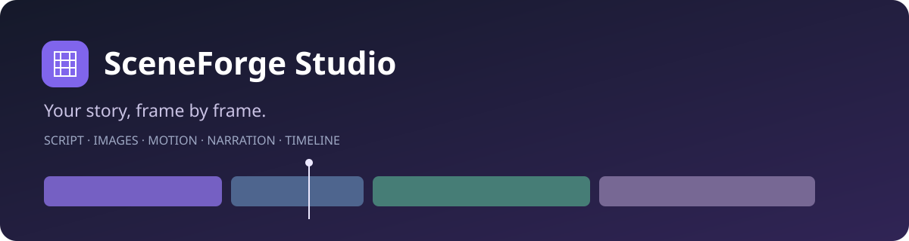</p>

# SceneForge Studio

**A free, open-source desktop editor for narrated documentary videos.** Turn a script, photos, clips and a voice into a finished film one scene at a time. You get film looks, captions that follow the narration, a multitrack audio timeline, stickers, titles and optional AI tools. Arabic and English are first-class.

[Install](#install) · [Highlights](#highlights) · [Feature tour](#feature-tour) · [AI providers and prices](#ai-providers-and-prices) · [Run from source](#run-from-source) · [Tests](#tests) · [Version history](#version-history) · [Licenses](#licenses-and-credits) · [Contributing](CONTRIBUTING.md)

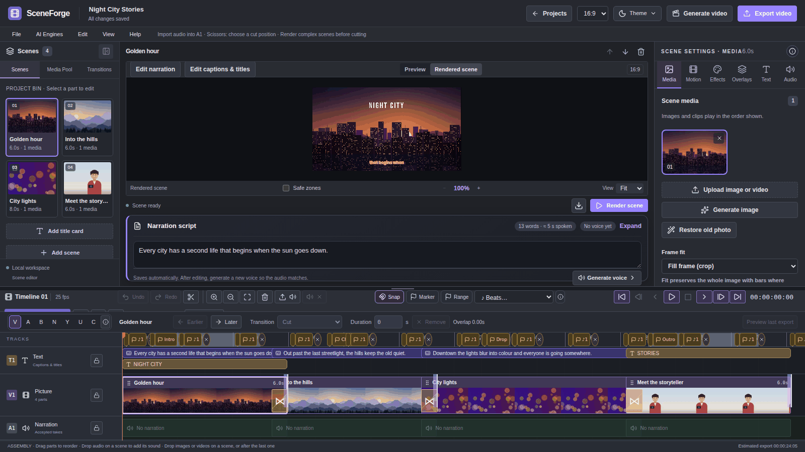

> **Release status.** The latest **published** release is **0.5.3**. Everything below that is marked *0.7.0* belongs to the **0.7.0 RC9** release candidate on the branch `claude/0.7.0-rc5-timeline`. It is **not published**. Its Windows installer exists only as a temporary GitHub Actions artifact, for testing. The full record is in [`desktop/RELEASE_NOTES.md`](desktop/RELEASE_NOTES.md) and [`PROJECT_HISTORY_AND_HANDOFF.md`](PROJECT_HISTORY_AND_HANDOFF.md).

The screenshots on this page come from the 0.7.0 RC9 build. They show a demo project made only from procedurally generated pictures, video and audio. [`scripts/capture_readme_screenshots.py`](scripts/capture_readme_screenshots.py) rebuilds the project and the screenshots.

## Highlights

- **Scene-based editing with a real timeline.** Pictures are edited per scene on V1, with text on T1, narration on A1 and clip sound on A2. Six independent audio tracks (A3–A8) take free audio clips.
- **Pro edit tools** for timeline audio: Select, Track select, Ripple, Roll, Slip, Slide and Blade, plus Razor All. There are also clip groups, colour and range markers, beat markers, volume envelopes and right-click menus. *(0.7.0)*
- **71 caption styles** in six groups, with word-by-word timing and correct Arabic right-to-left layout. Captions can come from **local Whisper** at no cost, or from optional cloud services.
- **Effects with per-effect settings:** 36 presets have their own controls *(0.7.0)*. There are film grades, halation, VHS, lens and camera effects, an effect stack with ordering and bypass, and drag-and-drop **look preset packs**.
- **400 stickers and emoji** *(0.7.0)*, **textured titles**, and **subject cutout** for photos and moving video, which puts text behind a person.
- **Audio finishing:** AI voice isolation, dialogue cleanup, beat-aware music fitting, beat sync, automatic ducking under narration and loudness levelling to −14 LUFS.
- **Optional AI generation.** Text-to-video runs locally through ComfyUI or in the cloud through Google Veo and Runway. Every cloud request shows a cost estimate and needs your confirmation. Image Studio supports several providers.
- **Exports** to YouTube, Shorts/Reels/TikTok, Instagram, ProRes, GIF, MP3/WAV and SRT/VTT. Rendering uses FFmpeg on your own computer.

## Feature tour

### Editor and timeline

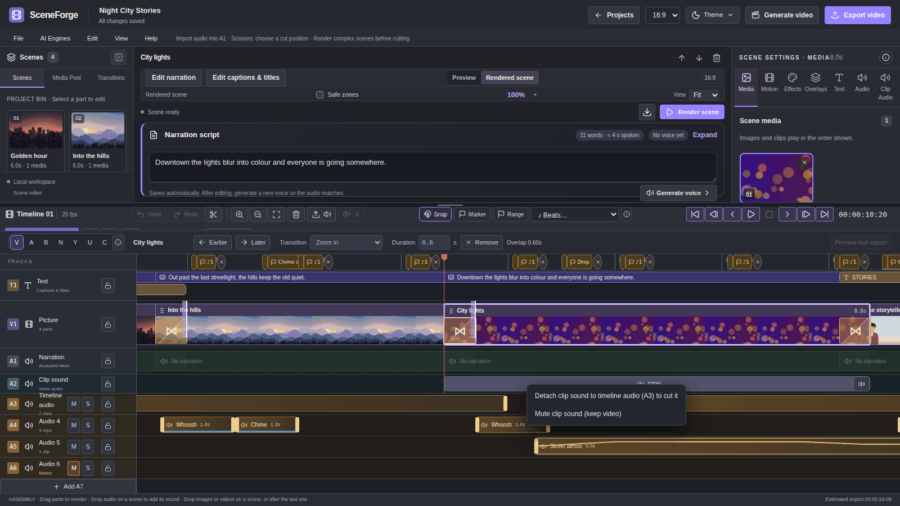

- **Tracks.** T1 holds captions and titles. V1 holds the scene pictures, with transitions overlapping. A1 holds the accepted narration, A2 the embedded sound of each video clip, and **A3–A8** independent audio clips. A whole-project **music bed** sits underneath. Each audio track has **mute, solo and lock**, and is dimmed when it will not be heard. *(A4–A8: 0.7.0)*
- **Edit tools** for timeline audio *(0.7.0)*:

  | Key | Tool |
  |---|---|
  | V | Select |
  | A | Track select forward |
  | B | Ripple trim |
  | N | Roll |
  | Y | Slip |
  | U | Slide |
  | C | Blade |
  | Shift+C | Razor All |

  Delete removes only the selected piece. Shift+Delete ripple-deletes it. Ctrl+C, Ctrl+X, Ctrl+V and Ctrl+D also work, and every edit can be undone.
- **Markers** are saved with the project. A marker can be a point or a range, in five colours, and can be **attached to a clip** so it moves with the clip. **♪ Beats…** finds the beat of the music bed or of a selected clip and marks every beat, every 2nd beat or every bar. Cuts and clips snap to the beat markers. *(0.7.0)*
- **Volume envelopes** take up to 32 keyframes on an A3–A8 clip, with presets such as *dip under a voice*. The line is drawn on the clip and heard in scene renders and in the export. **Clip groups** select and move together: Ctrl+G groups, and Ctrl+Shift+G ungroups. *(0.7.0)*
- **Right-click menus** for audio clips, scenes, narration and clip sound. From these menus you can split, duplicate, move a clip to another track, add a marker to the clip, or **detach narration or clip sound to A3** so you can cut it. *(0.7.0)*
- Everything that existed before: drag-and-drop of files and whole folders, 28 curated transitions with live previews, split and ripple delete, multi-select with batch apply, snapping, linked trimming of source video and audio, Ctrl+wheel zoom around the pointer, and undo/redo.
- The design notes are in [`docs/TIMELINE_ARCHITECTURE.md`](docs/TIMELINE_ARCHITECTURE.md). V1 is still scene-based. Free multitrack *video* and nested clips are not implemented yet.

### Captions and text

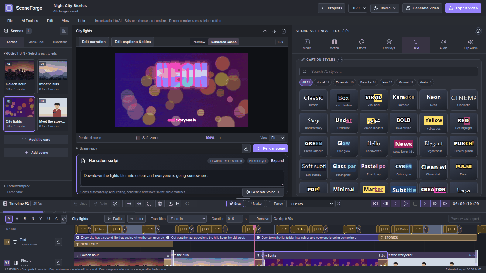

- **71 caption styles** in the groups Social, Cinematic, Karaoke, Fun, Minimal and Arabic, with search *(0.7.0: 40 new)*. You can also set the font, colours, outline, shadow, box, position, phrase or word-by-word splitting, karaoke highlighting and animation.
- **Automatic captions** from narration or video sound:
  - **Local Faster-Whisper** (the `base` model, about **145 MB**) downloads once on first use. After that it runs offline on the CPU, with no key.
  - ElevenLabs Scribe and OpenAI Whisper are optional cloud services.
  - A *Check local captions* panel diagnoses and repairs the local engine.
- **Title layers** (Text, Text Box, Text+) take more than 25 animations. The reveal set includes from-right, up, down, split, **clock wipe**, **counter-clockwise clock** and **iris** *(the last three: 0.7.0)*. There are also typewriter text with sound and per-letter and per-word animations.
- Arabic is rendered right-to-left, with Arabic caption styles and fonts (Noto Naskh, Amiri, Tajawal and Lalezar).

### Effects and looks

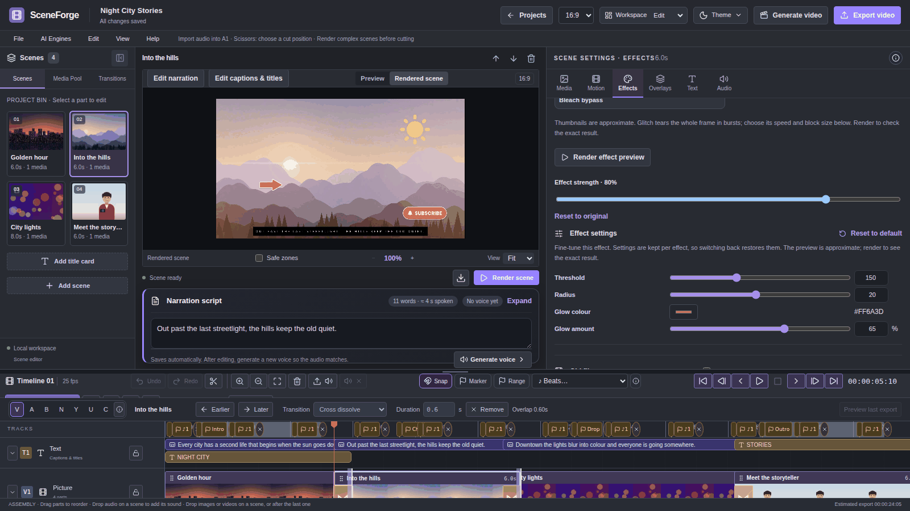

- **Per-effect settings** *(0.7.0)*. 36 presets have 132 settings between them. Examples are warmth, tint and fade for colour looks; bleed, noise, scanlines and tracking for VHS; and threshold, radius and colour for halation. Settings are remembered per effect, and default settings render exactly as before.
- **Looks:** 35 scene looks and film treatments, 8 colour filters (Golden hour, Arctic, Portra film and others), and Chromatic split and Motion trail. **Effects pack** *(0.7.0)*:
  - camera shake presets, lens flare and wiggle;
  - focus blur, tilt-shift and mosaic;
  - halation, 2383-style print, tungsten night and cross-process.

  All of these are rendered by FFmpeg. None of them are AI.
- **Colour tools:** sliders, colour wheels, split toning, `.cube` LUT import (3D, 1D and Resolve shaper LUTs), old film, spotlight, light leaks, and blur or pixelate to hide faces.

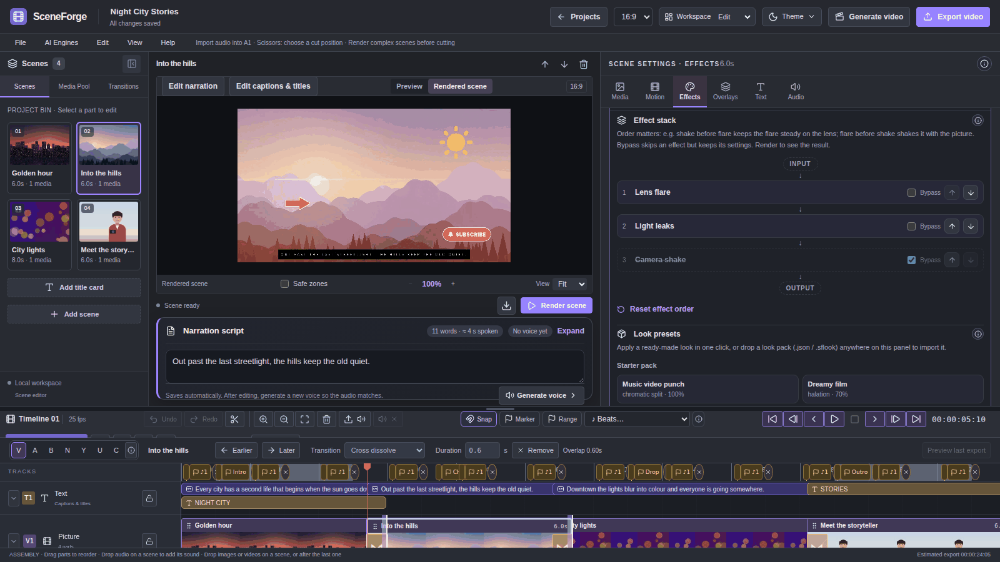

- **Effect stack** *(0.7.0)*. Spotlight, light leak, lens flare, wiggle and camera shake can be reordered or bypassed. The order changes the look: shake before flare keeps the flare steady on the lens.
- **Look preset packs** *(0.7.0)*:
  - Save the current look as a preset.
  - Drag a `.json` or `.sflook` pack onto the Effects tab to import it.
  - Export your own presets as a pack.
  - An 8-preset Starter pack is included.

  See [`docs/EFFECTS_GUIDE.md`](docs/EFFECTS_GUIDE.md).

### Stickers, titles and cutout

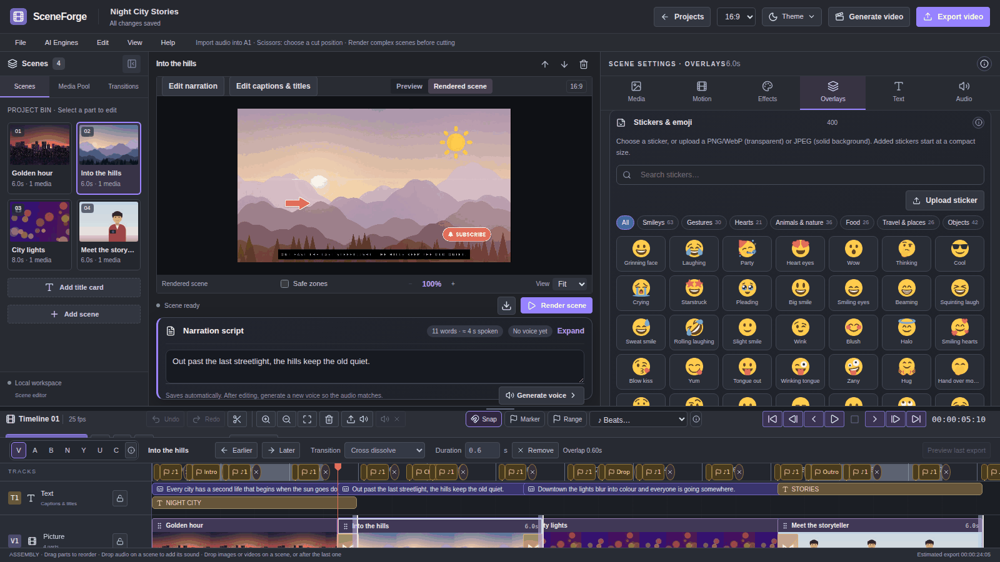

- **400 stickers and emoji** in 14 categories, with search and a Recent tab *(0.7.0)*. 322 are colour emoji from **Twemoji** (CC-BY 4.0). 78 are graphics drawn for SceneForge: subscribe and like buttons, badges, stamps, arrows, callouts, shapes and speech bubbles. The library is bundled, so it looks the same on every computer. Stickers can loop with float, bob or pendulum motion.
- **Picture-in-picture**, split-screen layouts, animated map routes, 3D photo (parallax), Ken Burns, restoration of old photos, and animated annotations. These were already in earlier releases.

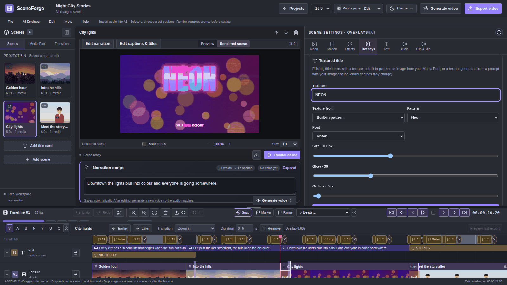

- **Textured titles** *(0.7.0)* fill big letters with a texture. The texture can be one of 9 built-in patterns (lava, neon, gold, chrome, marble, ice, fire, pixel blocks, galaxy), any image in your Media Pool, or a texture generated from a prompt by your image engine. Cloud image engines may charge for that. Titles support glow, outline, 8 fonts and Arabic.

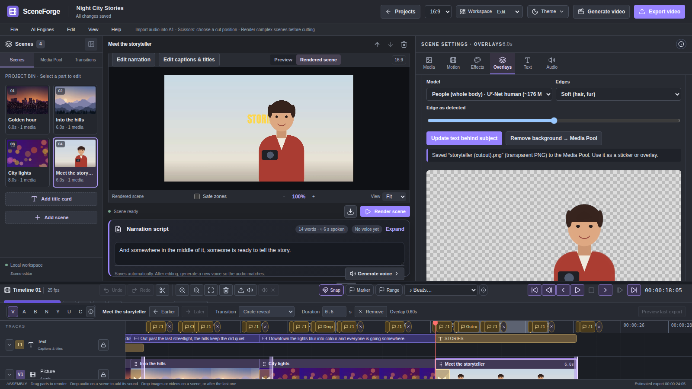

- **Subject cutout (AI, beta)** *(0.7.0)* runs locally with onnxruntime. It has two uses:
  - **Put text behind subject:** captions and titles pass behind a person or object.
  - **Remove background → Media Pool:** saves a transparent PNG.
- Cutout options:
  - Edge refinement, a ±10 px edge grow/shrink, and a result preview on a checkerboard.
  - Models: **U²-Net small** (~4.6 MB, bundled with the installer), **IS-Net** (~170 MB, best general quality) and **People** (U²-Net human, ~176 MB). The two larger models download once, on first use, and are checked against a checksum.
  - **Moving-video cutout** works on one clip of up to 20 s, with a static camera and normal speed. It renders a VP9 alpha layer in the background, with progress and Cancel.

### Audio

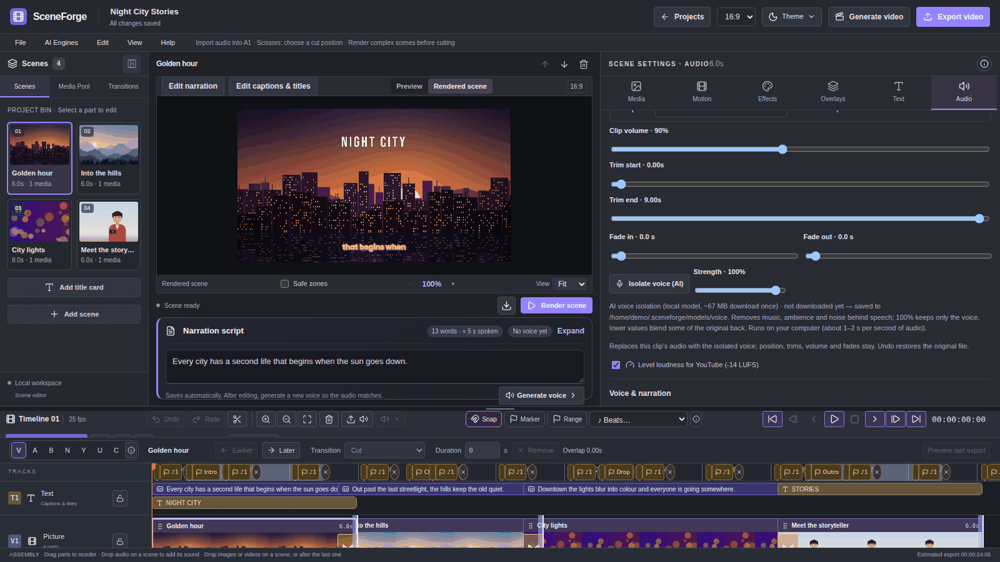

- **AI voice isolation** *(0.7.0)* uses a local MDX-Net model (Kim_Vocal_2, **~67 MB**, downloaded once and checked against a checksum). It is available for narration takes, timeline clips and video clip sound. A strength slider controls it, and your original files are never changed. In a synthetic test it raised voice SDR from 0 to 7.75 dB.
- **Dialogue cleanup** (noise reduction, not AI), **1940s radio** and **telephone** voice effects, and trim, volume, fades and waveform editing for narration.

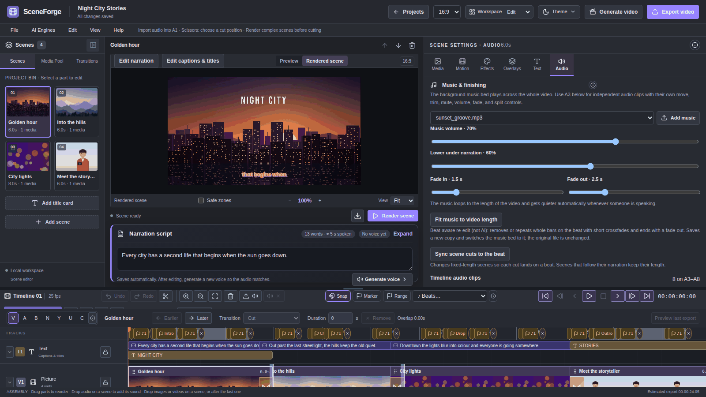

- The **music bed** loops and **ducks under narration** automatically.
- **Fit music to video length** *(0.7.0)* is a beat-aware re-edit, not AI. It removes or repeats whole bars.
- **Sync scene cuts to the beat**, **loudness levelling for YouTube (−14 LUFS)** and a film countdown leader are also available.
- When you play a rendered scene, you also hear the timeline audio and the music under it. The rendered part itself stays clean, so the export mixes each clip only once.

### AI generation (optional)

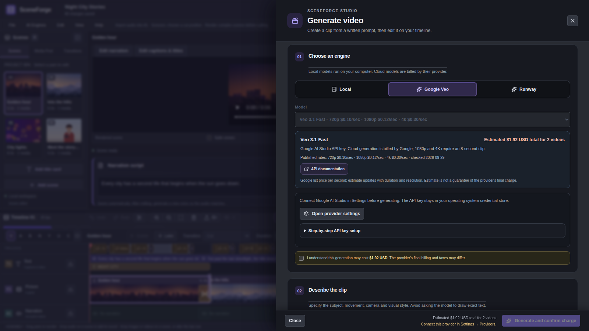

- **Text-to-video.** Run local ComfyUI workflows (LTX-2.5 Fast, Wan 2.1 T2V 1.3B, Wan 2.2 TI2V 5B, Wan 2.2 T2V A14B, or a custom API-format workflow), or use **Google Veo 3.1** or **Runway** (Gen-4.5, WAN 3.0) with your own key. A step-by-step setup guide and an optional GPU/VRAM check help you choose a local model.
- **Cost control.** Cloud requests show the provider's published per-second price and an estimated total for the 1–3 takes you request. Generation starts only after an explicit cost confirmation, which both the UI and the backend check. You can compare the finished takes and add the one you choose to a scene.
- **Image Studio** generates 1–3 options with OpenAI, Google Gemini, Cloudflare Workers AI, Hugging Face, or local Stable Diffusion (AUTOMATIC1111).
- ComfyUI, model weights, custom nodes and workflow files are **not** bundled or downloaded by SceneForge. Prices and models are listed under [AI providers and prices](#ai-providers-and-prices).

### Local voices (Chatterbox and Kokoro)

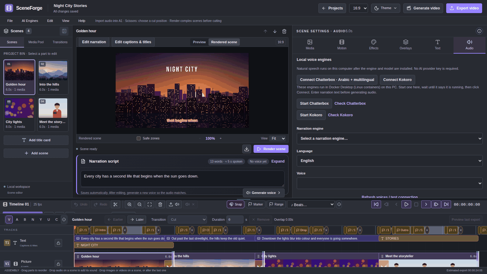

- **Chatterbox** (Arabic and multilingual) and **Kokoro** give natural narration with no provider key. They run as local services in **Docker Desktop** in Linux-containers mode.
- The installer includes the service files. **Start Chatterbox** and **Start Kokoro** buttons detect a missing or stopped Docker, show a live log and connect when the engine answers.
- The first start downloads container images and models, several GB for Chatterbox. Chatterbox uses CPU-only PyTorch. Chatterbox has not yet been confirmed working on a Windows test PC. Kokoro and the cloud voices are the fallback.
- **Cloud voices:** ElevenLabs (with exact word timing) and Together AI. You can also upload your own recordings.

### Export and share

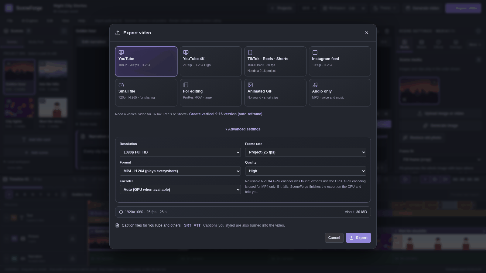

- Platform presets: YouTube (1080p and 4K), TikTok/Reels/Shorts (needs a 9:16 project), Instagram, a small H.265 file, ProRes for editing, animated GIF, and audio only.
- Advanced settings: resolution up to 4K, frame rate, format (MP4/H.264, H.265, WebM, ProRes, GIF, MP3, WAV) and quality.
- **SRT/VTT** caption files are exported alongside the burned-in captions. The sound of each video clip is kept and can be adjusted per clip.
- The **Share** dialog is local-first. It offers a download, opens the file's folder in the desktop app, and gives upload steps for YouTube, TikTok, Instagram and Facebook. It does not upload to your accounts.

### Preferences and themes

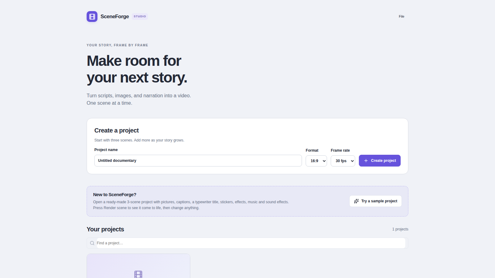

- Themes: **Graphite Night** (the default), **Daylight**, **Midnight Blue** and **Warm Studio**. Preferences are under **File → Preferences** and include an accent colour, panel spacing and reduced motion. The theme menu is also at the top right of the editor.
- You set the project format (16:9, 9:16, 1:1) and frame rate in **Create project**.
- The desktop close dialog offers Save, Don't save, Save and exit, and Cancel.
- Projects live in your user folder. The database is backed up automatically before a new version opens it (**Help → Open project backups**, last 5 kept).

## Install

Installers are on the **[Releases page](https://github.com/EzioDEVio/SceneForge/releases/latest)**. The current published version is **0.5.3**.

| System | File | First launch |
|---|---|---|
| **Windows 10/11** (64-bit) | `SceneForge-Studio-<version>-Windows-x64-Setup.exe` | Windows may show *"Windows protected your PC"*. Click **More info → Run anyway**. The warning appears because SceneForge has no paid code-signing certificate. |
| **Linux** (64-bit) | `.AppImage` (any distribution) or `.deb` (Ubuntu/Debian) | AppImage: make it executable (`chmod +x`) and run it. Deb: `sudo apt install ./SceneForge-Studio-*.deb` |
| **macOS** (Apple Silicon) | `.dmg` | Drag SceneForge to Applications. The first time, right-click the app and choose **Open**, then **Open** again. *macOS builds are experimental.* |

**Testing the 0.7.0 candidate (Windows).** Every push to `claude/0.7.0-*` runs the **Release** workflow. That run builds a `SceneForge-Studio-Windows` installer as a **GitHub Actions artifact**. Download it from the workflow run's *Artifacts* section. Artifacts expire, and they are not public releases. GitHub Releases are created only for `v*` tags.

**Updates.** On Windows and Linux (AppImage), SceneForge downloads new versions in the background and asks to restart. On macOS it tells you about a new version and opens the download page. **Help → Receive beta updates** opts you in to test versions.

### What is bundled and what downloads on first use

| Component | Size | How you get it |
|---|---|---|
| App, private Python backend, FFmpeg | — | Bundled in the installer |
| Fonts (Noto, Poppins, Bebas Neue, Anton, Pacifico, Amiri, Tajawal, Lalezar) and 400 stickers | — | Bundled |
| Cutout model U²-Net small (`u2netp`) | ~4.6 MB | Bundled *(0.7.0)* |
| Local Whisper captions (Faster-Whisper `base`) | ~145 MB | Downloads on first use |
| Cutout model IS-Net general use | ~170 MB | Downloads on first use, checked by checksum *(0.7.0)* |
| Cutout model People (U²-Net human) | ~176 MB | Downloads on first use, checked by checksum *(0.7.0)* |
| Voice isolation model (MDX-Net Kim_Vocal_2) | ~67 MB | Downloads on first use, checked by checksum *(0.7.0)* |
| Chatterbox and Kokoro voices | several GB (Chatterbox) | Docker Desktop (Linux containers) pulls them on first start |
| Stable Diffusion (AUTOMATIC1111), ComfyUI and video models | varies | Installed separately by you |

Downloaded models are kept in `%USERPROFILE%\.sceneforge\models\{whisper,cutout,voice}` (or `~/.sceneforge/models/…`). Provider keys are stored in the operating system's credential store (Windows Credential Manager, macOS Keychain, Linux Secret Service), never in project files.

## AI providers and prices

AI is optional. You can build a complete video from your own photos, clips and recordings without any account.

| Purpose | Cloud (your own account and key) | Local (free, on your computer) |
|---|---|---|
| Images | OpenAI, Google Gemini, Cloudflare Workers AI, Hugging Face | Stable Diffusion through AUTOMATIC1111 (point SceneForge at its folder in **AI Engines**) |
| Voice | ElevenLabs (with exact word timing), Together AI | Chatterbox and Kokoro (Docker); espeak as an optional robotic diagnostic voice |
| Captions | OpenAI Whisper, ElevenLabs Scribe | Faster-Whisper (model downloads once) |
| Voice isolation, subject cutout | — | Local ONNX models (see above) |
| Text-to-video | Google Veo 3.1, Runway Gen-4.5 and WAN 3.0 | ComfyUI workflows for LTX-2.5, Wan 2.1, Wan 2.2 and custom workflows |

### Text-to-video prices

This table shows the provider's published USD rate per generated second, as listed in the app's catalog. The prices were **checked on 2026-09-29** and can change. Provider billing, taxes, credits, retries and regional terms can change the final charge. Local generation has no API fee, but it uses your hardware and electricity. Check each model's license before you publish or use its output commercially.

| Provider and model | Published price | Output options in SceneForge |
|---|---:|---|
| Google Veo 3.1 Lite | $0.05/sec at 720p; $0.08/sec at 1080p | 4, 6 or 8 s; 16:9 or 9:16; 1080p only at 8 s |
| Google Veo 3.1 Fast | $0.10/sec at 720p; $0.12/sec at 1080p; $0.30/sec at 4K | 4, 6 or 8 s; 16:9 or 9:16; 1080p and 4K only at 8 s |
| Google Veo 3.1 Standard | $0.40/sec at 720p or 1080p; $0.60/sec at 4K | 4, 6 or 8 s; 16:9 or 9:16; 1080p and 4K only at 8 s |
| Runway Gen-4.5 | $0.12/sec (12 credits/sec at $0.01 per credit) | 2–10 s at 720p; 16:9 or 9:16 |
| Runway WAN 3.0 | $0.05/sec at 480p; $0.10/sec at 720p; $0.20/sec at 1080p | 2–30 s; 16:9 or 9:16; native audio |

Price references: [Google Veo pricing](https://ai.google.dev/gemini-api/docs/pricing#veo), [Veo API options](https://ai.google.dev/gemini-api/docs/veo), [Runway API pricing](https://docs.dev.runwayml.com/guides/pricing/), [Runway API changelog](https://docs.dev.runwayml.com/api-details/api_changelog/). Key setup: [Google AI Studio API keys](https://aistudio.google.com/app/apikey) ([instructions](https://ai.google.dev/gemini-api/docs/api-key)), [Runway API setup](https://docs.dev.runwayml.com/guides/setup/) ([Dev console](https://dev.runwayml.com/)).

**Local setup notes**

- Install and start ComfyUI yourself, then connect its loopback address under **Settings → Providers**.
- In ComfyUI, load the model's workflow and export it with **File → Export Workflow (API)**. Older versions call this **Save (API Format)**. Import the JSON into Generate video.
- Custom ComfyUI nodes run inside ComfyUI with your user permissions. Only import workflows and nodes you trust.
- Custom local dimensions must be multiples of 16.
- On an 8 GB GPU, start at 480p with Wan 2.2 5B (ComfyUI's native offloading) or the lighter Wan 2.1 1.3B. See the [Wan 2.2 setup](https://docs.comfy.org/tutorials/video/wan/wan2_2) and the [LTX ComfyUI setup](https://docs.ltx.io/open-source-model/integration-tools/comfy-ui).
- Takes are generated one after another. Each finished take is saved in the Media Pool, and completed takes are kept if a later one fails.
- Vast.ai remote GPUs are only a proposal and are not connected to the app. See [docs/VAST_GPU_RELAY_PROPOSAL.md](docs/VAST_GPU_RELAY_PROPOSAL.md).

## Run from source

Requirements:

- **Python 3.12.** The backend pins `numpy==2.5.3`, which needs 3.12.
- **Node.js 20 or later.** CI uses 22.
- **FFmpeg** on your PATH.

The desktop installer bundles its own Python runtime and FFmpeg. You only need these tools to run from source.

**Windows**
```bat
git clone https://github.com/EzioDEVio/SceneForge.git
cd SceneForge
scripts\setup.bat
scripts\start.bat          :: serves the built app at http://127.0.0.1:8000
scripts\dev.bat            :: or: backend with --reload on :8000 + Vite dev server on :5173
```

**macOS / Linux**
```bash
git clone https://github.com/EzioDEVio/SceneForge.git && cd SceneForge
python3.12 -m venv .venv && .venv/bin/pip install -r backend/requirements.txt
npm --prefix frontend ci && npm --prefix frontend run build
cd backend && ../.venv/bin/python -m uvicorn app.main:app --host 127.0.0.1 --port 8000
# open http://127.0.0.1:8000 (FastAPI serves frontend/dist on the same origin)
```

For frontend work, run `npm --prefix frontend run dev`. Vite then serves on port 5173 and proxies `/api` to the backend on port 8000.

Useful environment variables:

| Variable | Use |
|---|---|
| `SCENEFORGE_DATA_DIR` | A separate data folder, for tests |
| `SCENEFORGE_MODEL_DIR` | An existing Whisper model folder, for offline runs |
| `SCENEFORGE_CUTOUT_MODEL_DIR` | An existing cutout model folder, for offline runs |
| `SCENEFORGE_VOICE_MODEL_DIR` | An existing voice-isolation model folder, for offline runs |

**Build the desktop installers yourself**
```bash
pip install -r desktop/requirements-build.txt
npm --prefix frontend ci && npm --prefix frontend run build
npm --prefix desktop ci
python desktop/scripts/fetch_ffmpeg.py        # downloads and verifies FFmpeg for your OS
python desktop/scripts/fetch_models.py        # the bundled cutout model (u2netp)
python desktop/scripts/build_backend.py       # bundles the Python backend (PyInstaller)
npm --prefix desktop run dist:win             # or dist:mac / dist:linux
```

| Folder | What it is |
|---|---|
| `frontend/` | React 18 + TypeScript + Vite editor |
| `backend/app/` | FastAPI server, SQLite database, FFmpeg rendering (`render/`) and providers |
| `desktop/` | Electron shell, updater, packaging and build scripts |
| `assets/` | Bundled fonts, sounds, stickers and look packs |
| `tests/` | Integration tests that render real video and measure the result |

## Tests

```bash
npm --prefix frontend run build && npm --prefix frontend test   # editor, units, timeline, video-generation and share-dialog checks
ELECTRON_SKIP_BINARY_DOWNLOAD=1 npm --prefix desktop ci && npm --prefix desktop test
python tests/integration/test_combined.py                       # each integration test is a standalone script
```

- **Build and render checks** (`.github/workflows/checks.yml`) run on every push. They run the frontend build and tests, then **32 Python integration scripts** that render real media with FFmpeg.
- On Linux, the credential tests need a Secret Service keyring. Run them under `dbus-run-session` with `gnome-keyring-daemon` unlocked, as CI does.
- Tests never call paid providers. Those calls are mocked.
- **Last full local run (RC9):**

  | Suite | Checks |
  |---|---|
  | Frontend component checks | 264 |
  | Unit checks | 19 |
  | Timeline checks | 40 |
  | Video-generation flows | 2 |
  | Share-dialog checks | 6 |
  | Desktop checks | 18 |
  | Integration scripts | 32 |

  All passed. This does not replace testing on Windows.

## Version history

The table summarizes the documented history. Versions marked WIP or RC were development snapshots, not public releases. Details are in [`desktop/RELEASE_NOTES.md`](desktop/RELEASE_NOTES.md) and [`handoff.md`](handoff.md).

| Version | Milestone |
|---|---|
| **0.2.0 RC3–RC5** | Built out the scene editor: overlays/PiP, music and clip-audio editing, LUT import, film looks, transitions, photo restoration, split screen, map routes, 3D photos, motion controls and Arabic-aware caption rendering. These were prerelease milestones. |
| **0.3.0** | First public open-source release, with Windows/Linux/macOS installers, updater and project backups. |
| **0.3.1–0.3.4** | Guided AI Engines and Help, diagnostics, safer local-model startup, real transition/look previews, map-route improvements, paste-media support, branded installer and Windows stability fixes. |
| **0.4.0–0.4.1** | Animated titles and captions, text styles, animated annotations and Arabic map-label rendering fixes. |
| **0.5.0** | Captions Pro: expanded caption styles, fonts, Arabic styles, phrase/word timing, formatting, positioning and animation. |
| **0.5.1–0.5.2** | Direct annotation editing, accurate arrow previews, scene copy/duplicate/paste and preview zoom/pan. |
| **0.5.3** | Preserved video sound and source duration, per-clip sound controls, scene countdown intros, 9:16 fit/blur behavior, caption safe positioning and platform safe-zone overlay. **Latest published release.** |
| **0.6.0 WIP** | Additive editor expansion: local Whisper captions, transition/caption packs, multi-select, progress cards, export formats/presets, T1 timed editable caption clips, feature-help popovers, sharing, emoji/stickers, filters, and timeline/history/audio restoration. Unreleased. |
| **0.7.0 RC4** | Text-to-video and image candidates, local ComfyUI setup and hardware guidance, paid-provider cost estimates with confirmation, preferences and themes, a safer close flow, and more filters. Unreleased. |
| **0.7.0 RC5** | Timeline v1: A3–A8 tracks with mute/solo/lock, V/A/B/N/Y/U/C edit tools with Razor All, colour and range markers saved with the project, a versioned timeline format and viewport virtualization. Also fixes the active-render deletion CI failure. Unreleased. |
| **0.7.0 RC6** | Fixes from the Windows test: Delete removes only the cut audio, right-click menus, detach narration or clip sound to A3, timeline audio in scene renders, Whisper diagnostics, and in-app Chatterbox/Kokoro start. Adds the FFmpeg effects pack. Unreleased. |
| **0.7.0 RC7** | Local Whisper fixed (FFmpeg decodes the audio, without PyAV), black first render fixed, AI subject cutout and textured titles. Unreleased. |
| **0.7.0 RC8** | Better cutout (edge refinement, People model, preview, bundled small model), AI voice isolation, beat markers, volume envelopes, effect stack and look preset packs. Unreleased. |
| **0.7.0 RC9** | 400 stickers and emoji, 71 caption styles, settings for 36 effects, clock and iris reveals, moving-video subject cutout, clip groups and clip-attached markers. **Current candidate**, unreleased. |

### Releasing (maintainers)

1. Set the version in `desktop/package.json`, for example `0.7.0`, or `0.7.0-beta.1` for a beta.
2. Commit, then tag and push: `git tag v0.7.0 && git push origin v0.7.0`.
3. The **Release** workflow tests everything and builds the Windows, Linux and macOS installers. It attaches them to a **draft** release.
4. Review the draft and click **Publish release**. Users' apps offer the update only after that.

## Licenses and credits

SceneForge Studio is free software. You can redistribute it and modify it under the terms of the **GNU General Public License v3.0 or later**; see [LICENSE](LICENSE). It is provided WITHOUT ANY WARRANTY.

- **Bundled components** keep their own licenses: FFmpeg (GPL builds), Electron, Python libraries, and fonts under the SIL OFL. See [`desktop/THIRD_PARTY.md`](desktop/THIRD_PARTY.md).
- **Emoji:** [Twemoji](https://github.com/jdecked/twemoji) v17.0.3 graphics, Copyright Twitter, Inc. and other contributors, licensed **CC-BY 4.0** (`assets/stickers/LICENSE-TWEMOJI-GRAPHICS.txt`). The 78 graphic stickers were drawn for SceneForge (GPL-3.0-or-later).
- **Cutout models** are ONNX files published with rembg (MIT). According to `backend/app/render/cutout.py`, IS-Net general use and U²-Net small are **Apache-2.0**. The People model (`u2net_human_seg`) comes from the same rembg release; its licence is not stated in the code.
- **Voice isolation model:** Kim_Vocal_2 (MDX-Net, by Kimberley Jensen) comes from the Ultimate Vocal Remover model repository. UVR and python-audio-separator are MIT-licensed. **The weights have no explicit licence from their author, and this has not been confirmed.** Check it before you rely on the feature commercially. It must be resolved before a public release.
- **Other AI models and services** (Whisper models, Chatterbox, Kokoro, Stable Diffusion, ComfyUI models, cloud providers) are not part of SceneForge. They have their own terms, which may restrict commercial use.

Copyright © 2026 EzioDEVio and SceneForge contributors.

## Contributing and security

- Read [CONTRIBUTING.md](CONTRIBUTING.md) before opening a pull request. Keep database changes additive, add a real-render test for rendering changes, and never commit keys or personal media.
- Report vulnerabilities privately, as described in [SECURITY.md](SECURITY.md).
- [`PROJECT_HISTORY_AND_HANDOFF.md`](PROJECT_HISTORY_AND_HANDOFF.md) and [`HANDOFF_TO_CHATGPT_RC9.md`](HANDOFF_TO_CHATGPT_RC9.md) contain the implementation inventory, decisions and open items.
