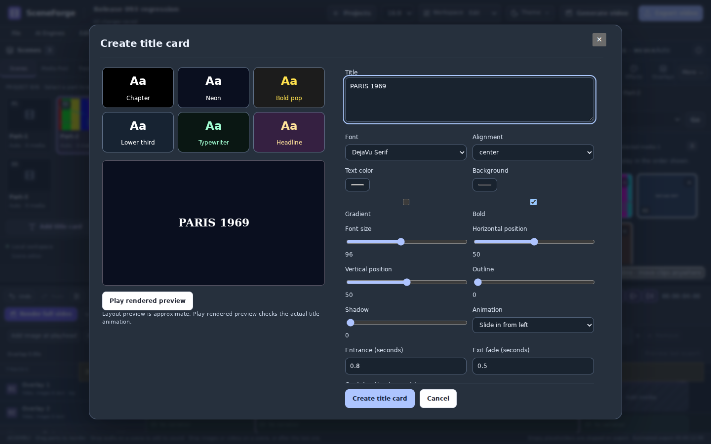
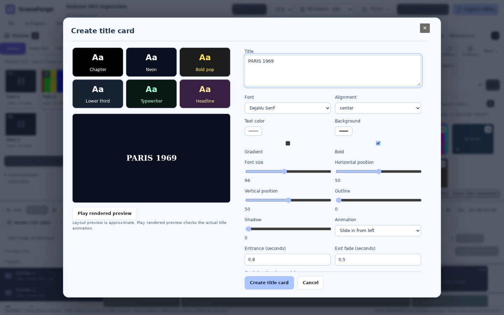

# Combined editing and local AI setup — owner-approved test checkpoint

Owner approved combining the typing, font, friendly layout and local AI setup
work into one ZIP for GitHub/installer testing. No external repository push,
tag or publication was performed. All earlier combined stages and fixes remain.

## Changes

- Title-card focus is initialized once. Parent updates and busy-state changes
  no longer steal focus, reset caret context or scroll back to the title.
  Escape still uses the latest close handler and respects the busy guard.
- Title cards use two panes: preset/live preview on the left, grouped editing
  controls on the right, and visible Create/Cancel actions. Small screens stack
  the panes. Stable scroll gutters, fixed preview geometry, bounded status text
  and disabled scroll anchoring reduce movement while typing and previewing.
- Shared font catalogue: 19 bundled families in title cards, scene text,
  independent text clips, textured titles and video-inside-text. Existing system
  caption fonts remain available. Nine new families are DejaVu Sans/Serif/Mono
  and Latin Modern Sans/Roman/Mono/Roman Slanted/Sans Demi Cond/Mono Caps.
  Original unmodified fonts and upstream license notices are included in both
  renderer assets and browser fonts. Existing Arabic families/fallbacks remain.
- Softer blue emphasis, rounded groups, more spacing, clear focus rings,
  readable hints and dark/light title-editor treatments. No tab was removed.
- Native Windows installer component page for Whisper, Stable Diffusion and
  Chatterbox, all initially selected. Terms review is required for selected
  downloads. The installer invokes the packaged backend's installation mode;
  detailed stages/download output appear in its progress log.
- AI Engines has the same installer, component selection, terms, GPU option,
  completed-stage progress, current cached model MB, Retry and startup switch.
  Disk shortage, occupied ports, unsupported platform and Docker setup/reboot
  requirements produce clear failures. Profiles are registered after successful
  model checks; existing user connections and startup choices are preserved.
  Only completed components are recorded for automatic startup. Native close
  readiness blocks exit during installation. Whisper runs directly; image/voice
  services use Docker. See LOCAL_AI_INSTALLER.md for exact capabilities.

## Completed checks in Linux

- Production TypeScript/Vite build at 0.9.3; existing large-bundle advisory only.
- All eight existing production Chromium harnesses passed. Final title-browser
  rerun passed after the two-pane layout and final font assets were compiled.
  English/Arabic typing keeps control position, focus and pane scroll unchanged.
- Full previous frontend suite plus the new friendly-editing/installer UI test
  pass. The latter verifies parent refresh focus preservation, latest Escape
  behavior, 19 fonts, terms gating, install payload, progress and platform guard.
- 190 real text preview responses, all 19 families, mixed Arabic/English and
  Latin-only text, real Latin/Arabic preflight, simulated Windows DLL failure,
  recovery messages and no mutation after failed title insertion passed.
- Real textured-title and video-inside-text rendering, repeated render cancel/
  retry stability, existing local image lifecycle and free-timeline integration
  checks passed. New managed AI contracts pass with mocked downloads/tools:
  ordered setup/model checks, profile preservation, space/port errors, Retry,
  startup preferences, no installation/build during startup and close readiness.
- Desktop lifecycle tests: 18 passed. Offline version/release/ZIP gates: 31
  passed. Version labels agree at 0.9.3. Python syntax and diff checks pass.
- Checkpoint budget is 40 MB to include the additional licensed font binaries.
  Empty/partial/corrupt ZIP, unsafe paths, private/runtime directories, missing
  compiled files and version drift still fail. New installer/engine files are
  required by the archive gate.

## Required Windows gates before publication

NSIS native compilation and actual Windows installation have not run here;
the Linux environment has no available NSIS compiler. The native packaged
backend/installer, fresh Docker installation and first-run/reboot behavior,
real Whisper/Chatterbox/SD downloads and inference, native credential storage
and NVIDIA GPU use require Windows testing. Mocked installation contracts do
not constitute those tests. No paid provider calls or model downloads occurred
during these checks. Large models are downloaded during installation, not
embedded in the small checkpoint ZIP.

The ZIP must be checked for corruption, exact manifest hashes, case-insensitive
paths, new fonts/installer/services, current compiled asset references and Git
bundle recovery, then tested after a clean extraction before delivery.

