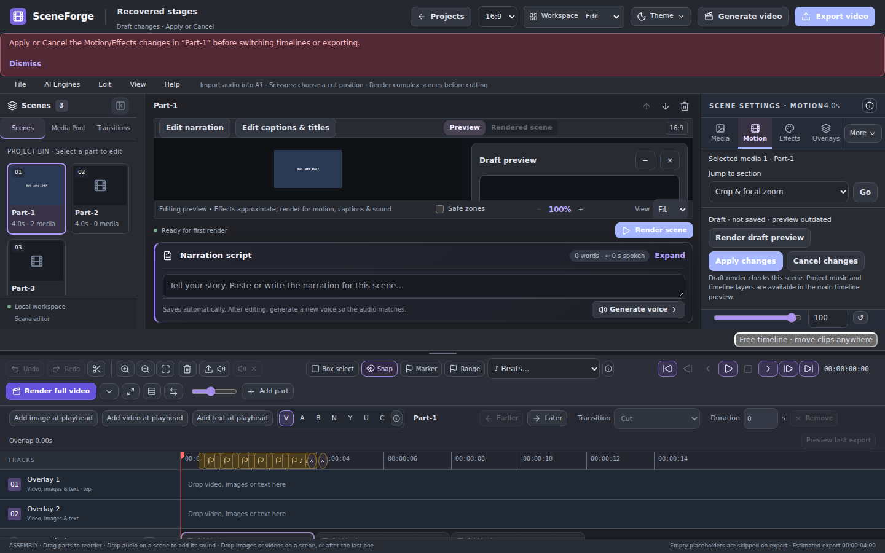

# SceneForge 0.9.3 — stability and stress review

Date: 6 October 2026. This review covers the corrected source checkout in Linux/Chromium. It does not certify a Windows installer. The owner subsequently approved packaging and pushing these corrections.

All 50 executed integration scripts, nine browser harnesses, and the frontend/desktop checks passed with the corrections described below. The native Linux vault gate remains blocked and Windows validation remains pending. No ZIP or push was performed during validation.

## Findings and corrections

The supplied screenshots showed a disabled Free timeline button and a persistent “Saving changes…” status. The recent diagnostic jobs were successful scene renders; no recent full export job appeared. A real Chromium reproduction found that an unapplied Motion/Effects draft was treated as a background save. This silently locked timeline entry, and full rendering waited for a save that would never happen.

The editor now distinguishes drafts from active saves. Free timeline and export direct the user to the relevant scene's Apply/Cancel controls. They preserve the draft and saved source; they never apply or discard a draft automatically. Ordinary pending narration, title and overlay saves finish before either action proceeds. Failed saves retain edits and show recovery guidance. Export takes the latest saved project snapshot.

The diagnostic logs also showed Windows console encoding failures during local-AI progress logging, and a Chatterbox service returning 404 for `/warmup`. Unicode logging now survives a legacy console while retaining the original progress text in the UTF-8 status file. An incompatible service shows an explicit instruction to stop the older engine using its port and retry. This guidance does not prove that the owner's engine or model download has been repaired; the real Windows setup needs retesting.

## Validation results

| Check | Result |
| --- | --- |
| Production frontend compilation | PASS |
| Frontend component/unit command, 14 test groups | PASS |
| Existing real Chromium harnesses, 8 | PASS |
| New timeline/export stability harness | PASS |
| Broad integration sweep, 46 scripts | PASS after correcting an outdated split-test expectation |
| Existing free-timeline API/render regression | PASS |
| Managed local-AI contract regressions | PASS |
| Bounded save/read/export stress | PASS |
| Full-resolution effects/audio finishing, 29 checks | PASS |
| Desktop lifecycle/update tests, 18 cases | PASS |
| Offline release/version/archive gates, 31 cases | PASS |
| NSIS page bounds and installer/uninstaller compile, 3 cases | PASS |
| Native Linux credential-store test | BLOCKED: execution environment denied the D-Bus socket |
| Native Windows installer interaction, NVIDIA execution and real model setup | NOT PERFORMED here |

The split test still checks exact audio settings, source offset, excerpt duration and restoration of source/shot IDs. Its expected dictionary now includes the current normalized empty censor list. The frontend failed-save regression now checks that export remains unopened with retained text and visible recovery guidance rather than requiring a silently disabled button.

The browser regression verifies an unapplied draft, Cancel preserving source data, immediately saving narration before opening Free timeline, twelve source/free round trips, and a real full export that completes and streams readable media with no JavaScript errors.

## Stress workload and limits

The stress test used a disposable database, two generated videos with embedded audio, and 60 source excerpts on six video tracks. It performed 80 sequential saves, then 120 reads across eight concurrent clients, checking that every placement survived. Eight consecutive real full exports completed; each had the expected four-second duration, decoded video/audio, unchanged placements, and no worker left busy. The workload completed in 43.8 seconds.

Stress outputs were 320×180 to keep the repeated-worker exercise bounded. Separate rendering regressions exercise higher resolutions. These checks do not cover hour-long projects, overnight memory stability, 4K stress, real Windows UI operation, NVIDIA rendering or multi-GB AI model downloads. Hosted-provider tests use fixtures and do not make paid provider calls.

The new browser and stress regressions are included in the normal browser/CI test commands. Machine-readable results and source hashes are in [results.json](stability-20261006/results.json).

## Owner's Windows recheck after an approved package

1. Change Motion or Effects, switch to Media, then click Free timeline or Render full video. Confirm the draft status and Apply/Cancel guidance appear. Cancel should preserve the saved scene; Apply should retain the intended change.
2. Edit narration and immediately enter Free timeline or export. Confirm the newest text saves before continuing.
3. Make repeated timeline cuts, move excerpts, save/reopen and render. Confirm the excerpt layout and output remain consistent; Source assembly should retain the original source scenes.
4. Verify all 19 font families and Video inside text rendered preview, then export a short scene containing text, images, video and captions.
5. Verify the installer acceptance checkbox is visible, and complete local-AI setup. If Chatterbox reports an older service on port 8881, stop that older engine in Docker Desktop and Retry. Capture fresh diagnostics if it fails again.
